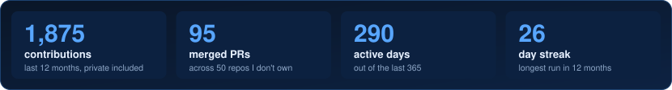
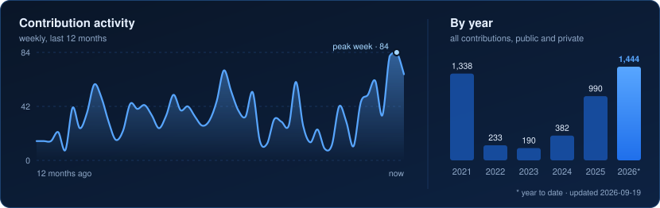
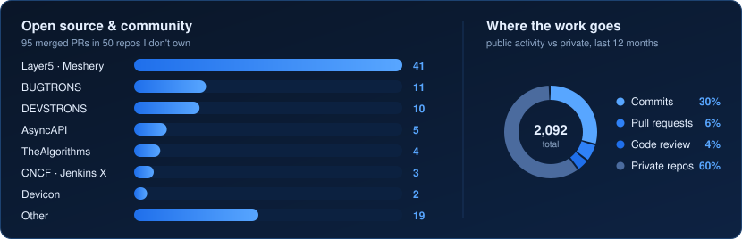

<h1 align="center">Anshumaan Kumar Prasad 🇮🇳</h1>

  

  
  
  
  

  <b>Senior Frontend Engineer</b> at <a href="https://intelxlabs.com">IntelXLabs</a> 
  React · Next.js · TypeScript · Node.js · Go &nbsp;|&nbsp; 4 years shipping type-safe SPAs and SSR/SSG apps to production

## What I do

I build the frontend layer of products where latency, correctness and maintainability actually matter: real-time systems, typed API boundaries and shared component libraries. I set review standards and pair with design and backend teams.

| Project | What I built |
| :-- | :-- |
| **HaaNaa**  real-money sports prediction | Next.js dashboard for live wagering. IAM-based RBAC with a Go backend, with permission-scoped UI rendered once at session load.  **20K daily users · API response time ↓50%** |
| **HOAShare**  property & community platform | A real-time chat SDK: singleton WebSocket, Lexical rich text, voice recording, S3 pipelines.  **Bundle size ↓60% across 18+ components** |
| **HOAShare**  TypeScript layer | Standardised 40+ API boundaries with tuple-based error handling and exhaustive type guards.  **Adopted as the team-wide code review standard** |
| **Xamtac**  marketing SaaS | Next.js SaaS with SSR content generation. Turned Figma specs into an accessible React component library; reviewed 50+ PRs a month.  **Lead conversion +25% · downtime ↓20%** |

## Things I build on my own

| Project                                                                      | What it does                                                                                                                                                            |
| :--------------------------------------------------------------------------- | :---------------------------------------------------------------------------------------------------------------------------------------------------------------------- |
| [**schemind**](https://github.com/aminoxix/schemind)                         | Runtime API shape-drift detection. Zero-dependency npm library with 7 framework adapters across Node, Python and Go, plus a CLI gate that fails CI on breaking changes. |
| [**fmgr**](https://github.com/aminoxix/fmgr)                                 | Document management system: nested folders, advanced search, audit timeline. Next.js, tRPC, Drizzle, Supabase, UploadThing.                                             |
| [**namepicker.ai**](https://github.com/aminoxix/namepicker.ai)               | AI-assisted naming, backed by [naamkaran-server](https://github.com/aminoxix/naamkaran-server).                                                                         |
| [**highliSense**](https://github.com/aminoxix/highliSense-browser-extension) | Browser extension for contextual highlighting, built with Svelte.                                                                                                       |

## Open source

  

  

- **Layer5 / Meshery** (CNCF): CI automation across the ecosystem, including label-commenter workflows, a GraphQL API docs workflow, an error-code utility runner and stargazer notifications. Also `mesheryctl pattern delete`.
- **AsyncAPI**: governance automation that converts the TSC board config from YAML to JSON, and the community and board pages on the website.
- **Devicon, Jenkins X, CHAOSS, CNCF artwork**: new icons (JetBrains, Prometheus), a mobile-view docs fix, GSoC ideas docs, and service mesh performance assets.
- **Community**: founded [DEVSTRONS](https://devstrons.org), a 500+ developer open-source community, as a GitHub Campus Expert and Postman Student Leader. Organised BUGTRONS, the first student-run debugging contest and conference.

## Stack

<table>
  <tr>
    <td><b>Frontend</b></td>
    <td></td>
  </tr>
  <tr>
    <td><b>Backend & data</b></td>
    <td></td>
  </tr>
  <tr>
    <td><b>Cloud & delivery</b></td>
    <td></td>
  </tr>
  <tr>
    <td><b>Design & tooling</b></td>
    <td></td>
  </tr>
</table>

Also: tRPC · TanStack Query & Table · Zustand · Mantine · Drizzle ORM · Storybook · Lexical · WebSockets · RBAC · SDK design

---

  The charts above are generated daily by a <a href="scripts/generate.mjs">GitHub Action</a> from the GraphQL API. Private activity is counted, never named.

